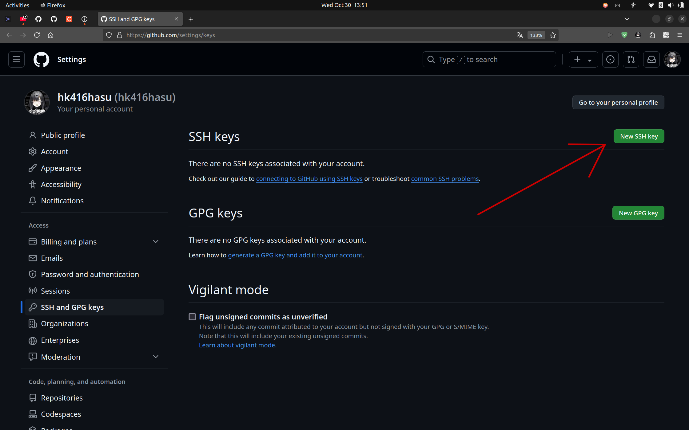
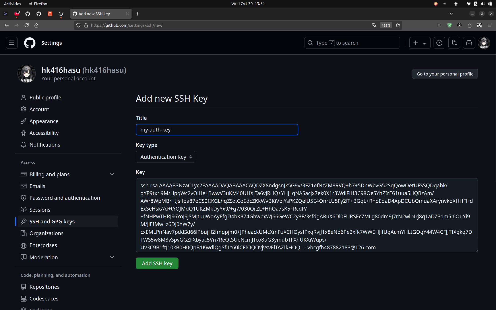

### 添加Github与主机间认证

​	首先回答为什么要添加Github与主机间认证？

​	答：为了防止未经授权的人访问你的 GitHub 账户，或push未经授权的commit，就是为了保证帐户安全。~~为了确认你是你。~~ 

我们选择用*ssh公钥方式*进行认证：

- 生成双钥（windows用cmd, linux直接用terminal）
  ```bash
  ssh-keygen -t rsa -b 4096 -C "xxx@yyy.com" # 此为你注册github用的邮箱
  ```
    - 然后会提示你可以更改密码文件名，既**可以不改直接回车**，也可以改成好记的密钥名
  
    - passphrase是用于提高密码强度的，**可以不填直接回车**
  
    - 这样双钥就生成好了，**存储路径**在屏幕上的输出信息呢，大概长这样：
  
      ```bash
      Your identification has been saved in C:\Users\user/.ssh/id_rsa
      # 或
      Your identification has been saved in /home/user/.ssh/id_rsa
      ```
  
- 在github中添加刚刚生成的公钥

  - 打开密钥的存储路径

  - 打开后缀为.pub的那个 *(.pub是公钥，请勿泄漏没有后缀的私钥)*

  - 复制公钥文件中那堆字符

  - 访问 https://github.com/settings/keys

  

  - SSH keys 右边点击 “New SSH key”

      - Title随便起
      
      - Key type为Authentication Key
      
      - Key 那一栏中，Ctrl-V 把刚才复制的公钥粘贴进去
      
      - 点击Add SSH key
      
      
      
  - 这样就在github中添加好你的公钥了

      

- 验证

    ```bash
    ssh -T git@github.com
    ...
    Are you sure you want to continue connecting (yes/no/[fingerprint])? yes
    
    # 如果没问题，会显示:
    # Hi hk416hasu! You've successfully authenticated, but GitHub does not provide shell access.
    ```
    
    
