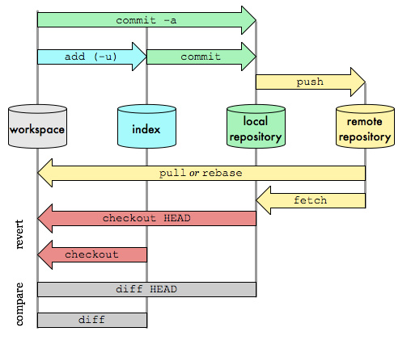
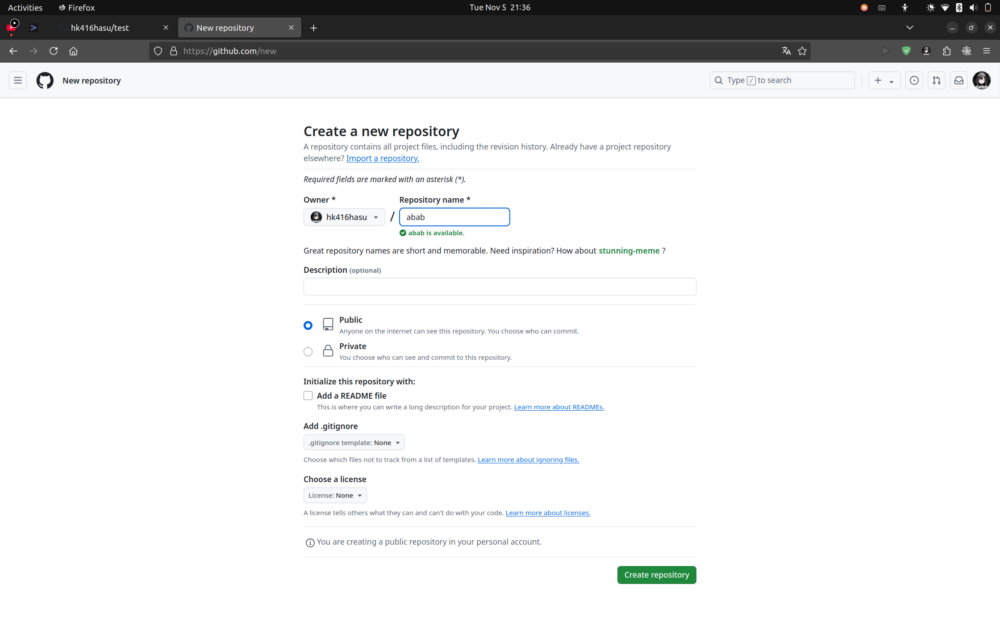
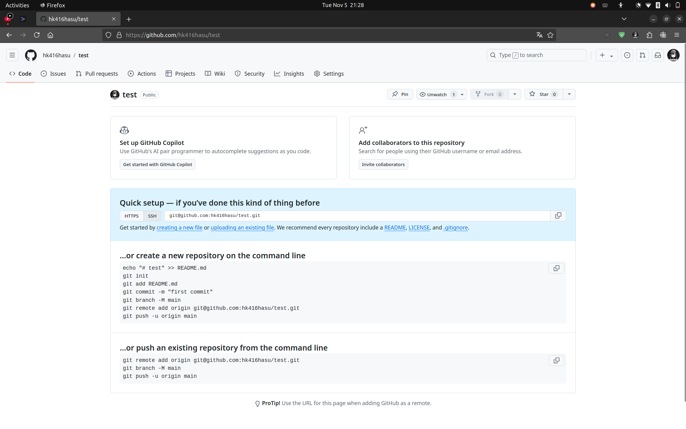

# git常用命令



左右两张图展示了git的基本工作流程，几乎是一样的，只是没有Project's Github repository

本章节就来分析这张图。

- Linux可使用terminal, Windows可使用git bash
- 暂时看不懂没关系，先照着做吧。用起来就懂了

### 1. 在本地初始化一个git仓库

仓库是什么？可以理解为存放很多个副本的地方。

如果没有设置git的user-name与user-email，请先设置：

```bash
git config --global user.name "你滴大名" # （都需要修改！）
git config --global user.email xxx@example.com # 请改成注册gihub的email
```

然后再初始化仓库：

```bash
cd ./target_dir              # 进入目标文件夹（需要修改！）
git init                     # 初始化一个仓库
echo # test > README.md      # 在README.md文件中写入test
git add README.md            # 将README.md加入缓冲区
git commit -m "first commit" # 提交缓冲区文件进入仓库
git branch -M main			 # 修改分支名称为main
```

本地仓库就搭建好了！

### 2. git基本工作流程


上一步我们创建了一个新的git本地仓库，这东西怎么用呢？我们先来讲讲git的基本工作流程

我们主要是工作在**workspace（工作树）**，在此可以随心所欲地修改/添加/删除文件，
当你满意后，可以用**git add**命令将workspace中的部分文件添加到**index（暂存区）**，
如果没啥问题，可以用**git commit**命令将index中的文件添加到**local repo（本地仓库）**中，

这就是最基本的git工作流程，只是为不同阶段的文件夹创建快照/副本。
诸如**git add**与**git commit**等命令，在GUI工具中可能体现为某个按钮，但本质是一样的。

**推荐观看 [The Missing Semester - 版本控制(Git)](https://www.bilibili.com/video/BV1Wh4y1s7Lj/)**

### 3. 在github新建一个仓库

打开这个链接，注意改一下名字：https://github.com/YourName?tab=repositories

- 点击右上角的New
  

- 简单输入一下仓库名就行
  

- 然后就建好仓库了, 可以**根据页面上的提示**新建本地仓库。
  该方法简单就简单在：可以直接复制github提示的命令，但GUI工具用不了。
  
