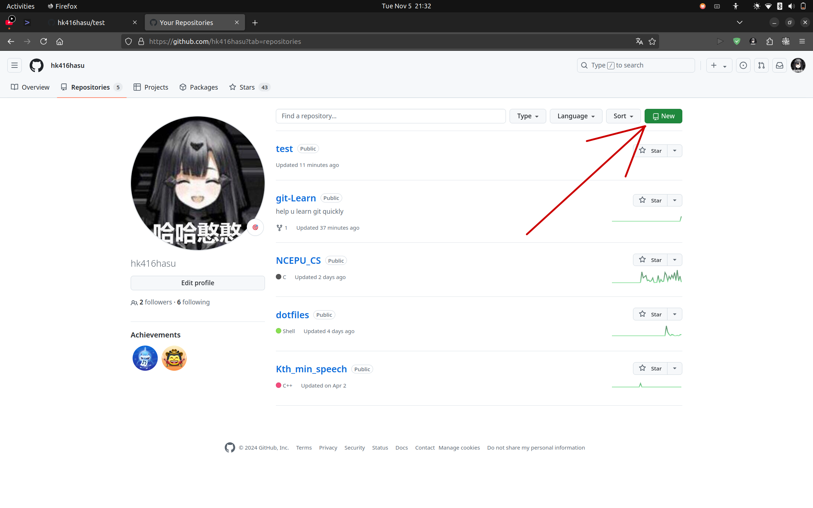

# git常用命令


这两张图展示了git的基本工作流程，几乎是一样的，只是没有Project's Github repository

本章节就来分析这张图。

- Linux可使用terminal, Windows可使用git bash

### 1. 在本地初始化一个git仓库

仓库是什么？可以理解为存放很多个副本的地方。

如果没有设置git的user-name与user-email，请先设置：

```bash
git config --global user.name "你滴大名" # （都需要修改！）
git config --global user.email xxx@example.com # 请改成注册gihub的email
```

然后再初始化仓库：

```bash
cd ./target_dir              # 进入目标文件夹（需要修改！）
git init                     # 初始化一个仓库
echo # test > README.md      # 在README.md文件中写入test
git add README.md            # 将README.md加入缓冲区
git commit -m "first commit" # 提交缓冲区文件进入仓库
git branch -M main			 # 修改分支名称为main
```

本地仓库就搭建好了！

### 2. 在github新建一个仓库

打开这个链接，注意改一下名字：https://github.com/YourName?tab=repositories

点击右上角的New



最简单的，输入一下仓库名就行，然后
