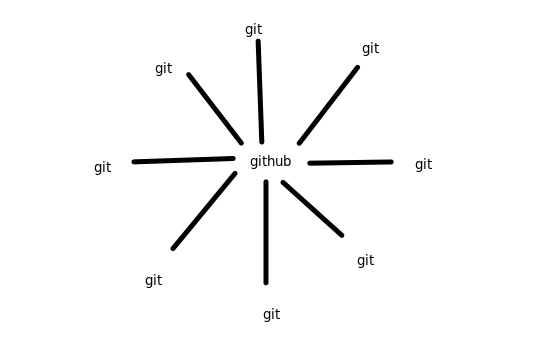
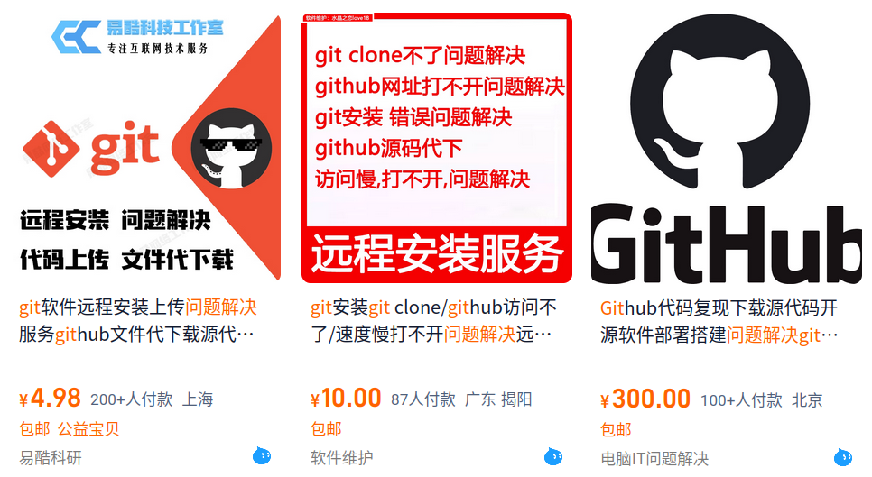

# git杂谈

### 1. 什么是git？什么是github？

- git是一种**版本控制工具**，github则是一个**代码托管平台**。

- hub本就有“集线器”之意，顾名思义，github就是将各个末稍(主机)的git仓库保存在中心.

- 本来有张AI图的，但生成的实在太不合我意了，我遂亲自出马，作下图：

### 2. 为什么需要版本控制工具 / 学了有哪些收获？

- 年轻人哟，想必你曾将文件复制好几个副本，并改名xxx最终版、xxx绝对不改版...吧（如果足够聪明，还会给文件加上时间戳）。

- 但至少对我来说，这些粗糙的版本控制并没有良好的效果——我记不住哪个是最终版了，也不知道任意两个版本中间有什么区别，而且文件好多，好烦，删除之！

- 开源版本控制工具git就是来帮助你的解决类似的烦恼的！**不仅不要钱，学成还能赚钱。**

- 请看vcr :

### 3. 为什么选择git 与 github？

- 开源精神, 学会后给开源项目做贡献
- 老板需要，写简历上加分
- 比较流行，毕竟git与linux一样，都是Linus一手开发的

### 4. 新手如何开始？

- 先初步学会用，边用学熟悉
- 再深入学习按键/命令背后发生的事
- ~~智能手机也很复杂，但点点屏幕会操作不也就够了嘛~~ :D

