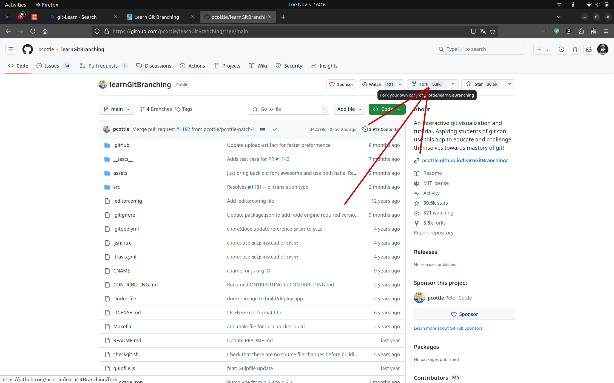
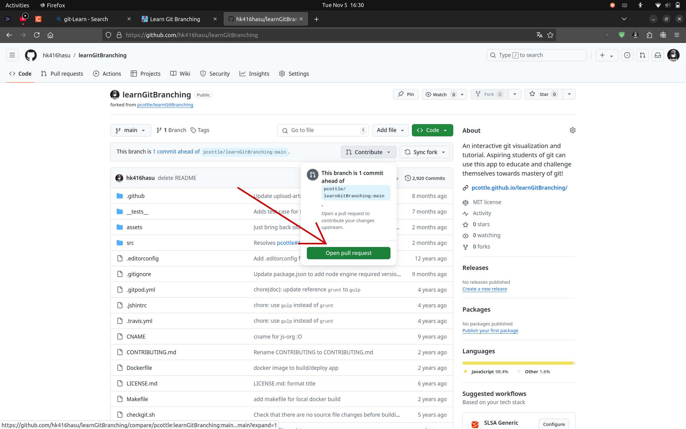

# 如何利用GitHub合作？

写完才想起来应该RTFM(Read The Friendly/Fu*** Manual), 推荐读官方文档：

https://docs.github.com/zh

### 1. 注册github帐号
- 打开 https://github.com
  - 打不开? 连WIRELESS-NCEPU可上
- 点击右上角Sign UP注册帐号
- 按照流程注册便是，不要忘了注册用的email

### 2. 添加github与主机间认证

**官方文档链接**：
https://docs.github.com/zh/authentication/connecting-to-github-with-ssh/generating-a-new-ssh-key-and-adding-it-to-the-ssh-agent?platform=windows

​	首先回答**为什么**要添加Github与主机间认证？

​	答：为了防止未经授权的人访问你的 GitHub 账户，或push未经授权的commit，就是为了保证帐户安全。~~为了确认你是你。~~ 

我们选择用*ssh公钥方式*进行认证：

- 生成双钥（windows用cmd, linux直接用terminal）
  ```bash
  ssh-keygen -t rsa -b 4096 -C "xxx@example.com" # 此为你注册github用的邮箱
  ```
    - 然后会提示你可以更改密码文件名，既**可以不改直接回车**，也可以改成好记的密钥名
  
    - passphrase是用于提高密码强度的，**可以不填直接回车*2**
  
    - 这样双钥就生成好了，**存储路径**在屏幕上的输出信息呢，大概长这样：
  
      ```bash
      Your identification has been saved in C:\Users\user/.ssh/id_rsa
      # 或
      Your identification has been saved in /home/user/.ssh/id_rsa
      ```
  
- 在github中添加刚刚生成的公钥

  - 打开密钥的存储路径

  - 打开后缀为.pub的那个 *(.pub是公钥，请勿泄漏没有后缀的私钥)*

  - 复制公钥文件中那堆字符

  - 访问 https://github.com/settings/keys


  - SSH keys 右边点击 “New SSH key”

      - Title随便起
      
      - Key type为Authentication Key
      
      - Key 那一栏中，Ctrl-V 把刚才复制的公钥粘贴进去
      
      - 点击Add SSH key
      


​	这样就在github中添加好你的公钥了

- 验证

    ```bash
    ssh -T git@github.com
    ...
    Are you sure you want to continue connecting (yes/no/[fingerprint])? yes
    
    # 如果没问题，会显示:
    # Hi hk416hasu! You've successfully authenticated, but GitHub does not provide shell access.
    ```
    

### 3. 利用github合作的一种方式（线下详细讲）


这里我们主要讨论该图的上半部分，即远程仓库部分。（仓库是什么？它存储了一系列代码快照, 可以理解为仓库存储了不同阶段的代码文件夹，但不是简单的复制粘贴）

首先，你在github上看到有个蛮不错的开源仓库, 或者是项目合作用的仓库，叫Project's GitHub repository（源仓库）。

然后，你想参与这个项目的合作：**点击页面上的fork**（fork有复制的意思），会跳出一个新页面，在新页面点击Create fork



这就已经将该仓库复制到你的帐户下了，即Your GitHub repository. （这个新页面会自己跳出来，就不再截图了，各位可以用本教程仓库hk416hasu/git-Learn仓库练手）

而后你可以开心地使用git clone将Your GitHub repo下载到本地，进行一系列的修改。倘若你想把成果提交给源仓库，为开源项目做贡献，请在github中“Open pull request(PR)"。~~如果可能的话，不妨发微信戳一戳源仓库拥有者（也许是你的组长），提醒他该检查PR了。~~

稍后源仓库拥有者或维护者会检查PR, 并选择采纳或拒绝。**当然最重要的还是和他们讨论和沟通啦！**


